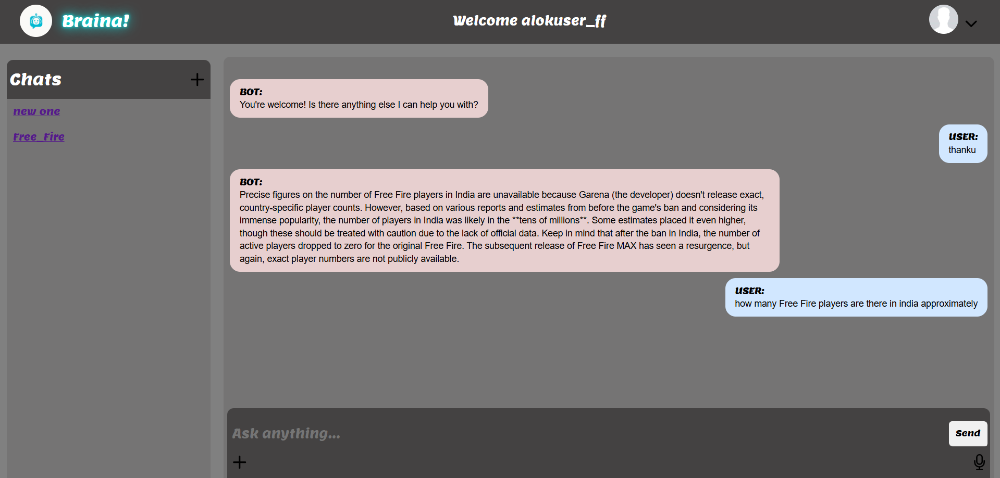
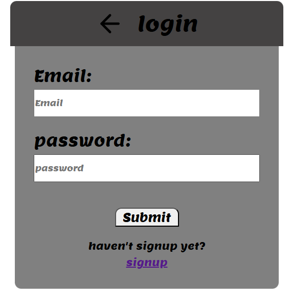
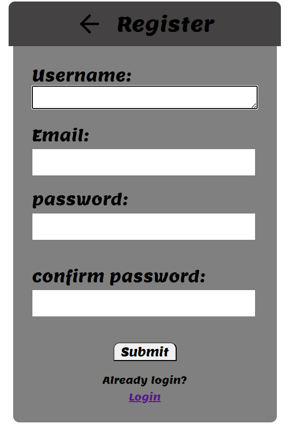

# 🤖 Chatbot-AI Web Application

An intelligent AI-powered chatbot web application built using **Django** and integrated with **Gemini API** for generating human-like responses. Users can create or join chat rooms, interact with an AI assistant, and manage sessions with secure authentication.

---

## 🚀 Features

### 🧠 AI Chat Integration
- Real-time answers using **Gemini AI API**
- User input sent via form, bot response fetched dynamically
- Simple, conversational interface

### 👥 User Authentication
- **Signup, Login, Logout** flow
- Custom user model with form validation
- Session-aware UI (hides/shows buttons based on login state)

### 💬 Multi-Room Chat System
- Create or select different **chat rooms**
- Each room maintains separate chat history
- Messages saved and displayed room-wise

### 🧾 Message Storage (Database)
- Uses **SQLite3** for local database
- Stores user questions and bot responses
- Clean separation of user, room, and message models

### 🛡️ Security & Best Practices
- Secrets and credentials stored in a **`.env` file**
- **`.gitignore`** configured to exclude `.env`, DB, and virtual environments
- Sample `.env.example` provided for setup reference

---

## 🔧 Tech Stack

| Technology | Purpose |
|------------|---------|
| Django     | Web Framework |
| SQLite3    | Database |
| Gemini API | AI Integration |
| HTML/CSS/JS | Frontend |
| Python     | Backend Logic |

---

## 📁 Project Structure
chatbot/  
├── bot/ # Django app with views, models, forms  
├── templates/ # HTML templates  
├── static/ # Static JS/CSS files  
├── db.sqlite3 # SQLite database (excluded from Git)  
├── .env # Environment variables (excluded)  
├── .env.example # Example environment file  
├── .gitignore  
└── manage.py  


---

## 📦 Setup Instructions

1. **Clone the repository**  


git clone https://github.com/yogeswar2006/Chatbot-AI.git  
cd Chatbot-AI  
python -m venv venv     #create a virtual environment for project  
venv\Scripts\activate   #activate virtual environment  

pip install -r requirements.txt    #optional...  

cp .env.example .env  
# Edit the .env file with your actual SECRET_KEY and Gemini API key  

python manage.py migrate    #make migrations to update changes you made  
python manage.py runserver  #runserver....  

http://127.0.0.1:8000/     #open this port in your browser  
 bash```

## 📷 Screenshots

### 🏠 Home Page




### 🔐 Login Form



### Register Form




🙌 Author  
Made with ❤️ by Yogeswar Reddy

GitHub= https://github.com/yogeswar2006


🛡️ License
This project is open source and available under the MIT License.

---

Let me know if you also want a matching `requirements.txt`, or help deploying this project online (e.g., on **Render**, **Railway**, or **GitHub Pages** for frontend).
